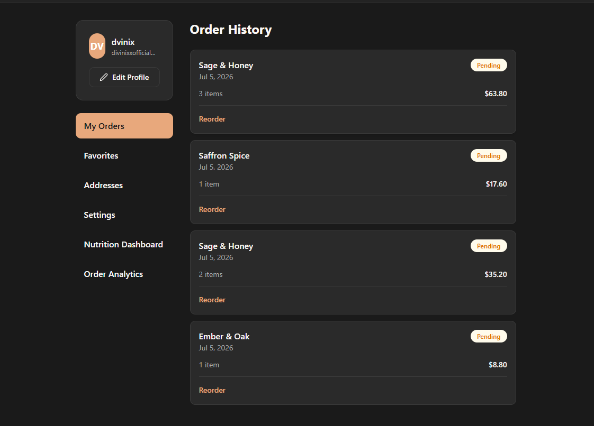
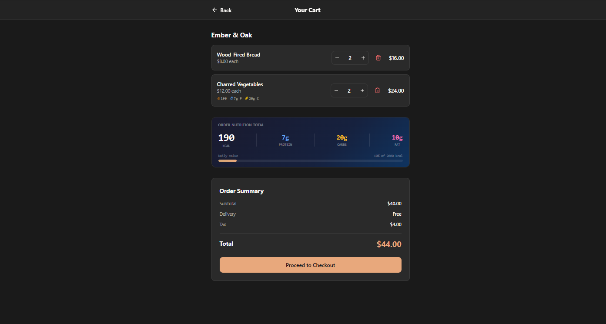
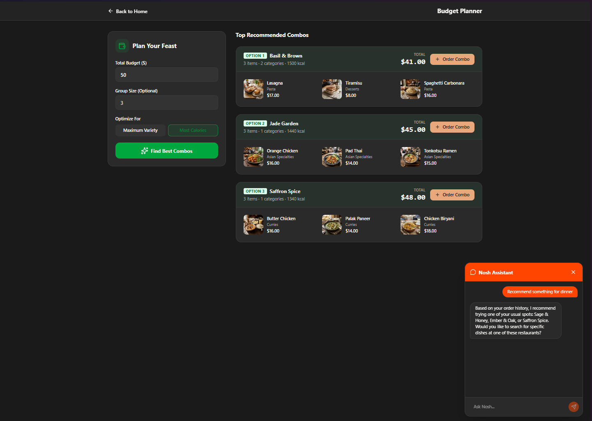
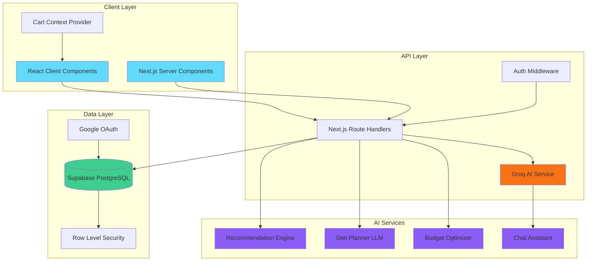
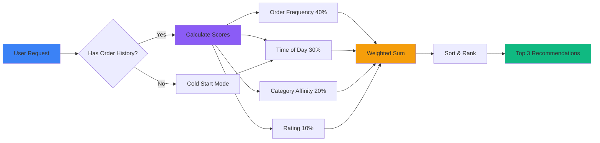

<div align="center">
  
# 🍜 Nosh

### Next-Generation AI-Powered Food Delivery Platform

[](https://nosh-psi.vercel.app/)
[](https://nextjs.org/)
[](https://www.typescriptlang.org/)
[](https://supabase.com/)
[](https://groq.com/)

**[🚀 Live Demo](https://nosh-psi.vercel.app/)** • **[📖 Documentation](./ARCHITECTURE.md)** • **[🧠 AI Logic](./AI_RECOMMENDATION_LOGIC.md)**

</div>

---

## 🌟 Overview

**Nosh** is a modern, AI-powered food delivery application that reimagines the online ordering experience. Built with cutting-edge technologies, it combines intelligent recommendations, personalized nutrition tracking, and conversational AI to make food ordering smarter, healthier, and more enjoyable.

<div align="center">
  
  <p><em>Intelligent AI-powered restaurant recommendations tailored to your taste</em></p>
</div>

---

## ✨ Key Features

### 🎯 Smart Ordering Experience

#### **AI-Powered Recommendations**
Advanced recommendation engine that analyzes your order history using multi-factor scoring:
- **Order Frequency Analysis** (40% weight) - Identifies your favorite spots
- **Time-of-Day Matching** (30% weight) - Context-aware suggestions based on meal time
- **Category Affinity** (20% weight) - Learns your taste preferences
- **Quality Rating** (10% weight) - Ensures top-rated establishments

<div align="center">
  
  <p><em>Complete order history with detailed tracking</em></p>
</div>

#### **Intelligent Cart Management**
- Single-restaurant cart lock with smart prompts
- Real-time nutritional information display
- Seamless checkout experience with order confirmation

<div align="center">
  
  <p><em>Cart showing real-time nutritional information</em></p>
</div>

---

### 🤖 Groq-Powered AI Assistant

Conversational AI chatbot powered by **Groq's `llama-3.3-70b-versatile`** with advanced tool calling capabilities:

- 🔍 **Search Dishes** - Natural language queries like "Find me spicy vegetarian dishes under $12"
- 📜 **Order History Access** - "What did I order last Tuesday?"
- 🎯 **Smart Recommendations** - "Suggest something new based on my taste"
- 💡 **Contextual Awareness** - Understands your preferences and dietary restrictions

<div align="center">
  
  <p><em>AI Assistant providing personalized suggestions and budget planning</em></p>
</div>

---

### 🥗 Nutrition Intelligence

#### **Comprehensive Nutrition Tracking**
- Monthly calorie consumption dashboard
- Macronutrient breakdown (Carbs, Protein, Fat)
- Interactive data visualizations powered by Recharts
- One-click Excel export for detailed analysis

<div align="center">
  
  <p><em>Beautiful monthly nutrition analytics dashboard</em></p>
</div>

#### **AI-Generated Health Insights**
Real-time nutritional analysis with personalized health recommendations for each dish.

<div align="center">
  
  <p><em>AI-powered health insights and nutritional recommendations</em></p>
</div>

---

### 📅 Smart Meal Planning

#### **Weekly Diet Planner**
AI-powered meal planning using **Groq's `openai/gpt-oss-120b`** model:
- Set daily calorie targets
- Choose dietary preferences (Vegetarian, Non-Vegetarian, Vegan)
- Generates 7-day personalized meal plans
- Maps to real dishes from the Nosh catalog
- Plans cached securely in database

<div align="center">
  
  <p><em>AI-generated 7-day personalized meal plan</em></p>
</div>

#### **Budget Optimizer**
Deterministic algorithm for budget-conscious ordering:
- Finds optimal dish combinations within your budget
- Single-restaurant constraint enforcement
- Optimization modes: **Maximize Variety** or **Maximize Calories**
- Generates top 3 combinations using greedy knapsack algorithm

---

### 📊 Advanced Analytics

#### **Order Analytics Dashboard**
Beautiful data visualizations tracking:
- Monthly spending trends
- Top cuisine preferences
- Favorite ordering days and times
- Restaurant frequency analysis

<div align="center">
  
  <p><em>Comprehensive analytics with interactive charts</em></p>
</div>

---

## 🏗️ Architecture

### System Design



### Recommendation Engine Flow



---

## 🛠️ Tech Stack

### Frontend
- **Framework:** Next.js 14 (App Router with React Server Components)
- **Language:** TypeScript
- **Styling:** Tailwind CSS
- **UI Components:** Custom component library with Radix UI primitives
- **Icons:** Lucide React
- **Charts:** Recharts
- **State Management:** React Context API

### Backend
- **Runtime:** Node.js with Next.js Server Actions
- **API:** Next.js Route Handlers (Serverless Functions)
- **Authentication:** Supabase Auth with Google OAuth
- **Database:** Supabase (PostgreSQL)
- **Security:** Row Level Security (RLS) policies

### AI & Machine Learning
- **LLM Provider:** Groq API
- **Chat Model:** `llama-3.3-70b-versatile` (function calling)
- **Planning Model:** `openai/gpt-oss-120b`
- **Recommendation Algorithm:** Custom multi-factor scoring system

### Database Schema
```
users
├── id (uuid)
├── email (text)
└── created_at (timestamp)

restaurants
├── id (uuid)
├── name (text)
├── cuisine (text)
├── rating (numeric)
└── image_url (text)

dishes
├── id (uuid)
├── restaurant_id (uuid)
├── name (text)
├── price (numeric)
├── category (text)
├── calories (integer)
└── tags (text[])

orders
├── id (uuid)
├── user_id (uuid)
├── restaurant_id (uuid)
├── total_price (numeric)
└── created_at (timestamp)

order_items
├── id (uuid)
├── order_id (uuid)
├── dish_id (uuid)
└── quantity (integer)

diet_plans
├── id (uuid)
├── user_id (uuid)
├── daily_target (integer)
└── plan_data (jsonb)
```

---

## 🚀 Getting Started

### Prerequisites
- Node.js 18+ and npm
- Supabase account
- Groq API key

### Installation

1. **Clone the repository**
   ```bash
   git clone https://github.com/yourusername/nosh.git
   cd nosh
   ```

2. **Install dependencies**
   ```bash
   npm install
   ```

3. **Set up environment variables**
   
   Create a `.env.local` file in the root directory:
   ```env
   NEXT_PUBLIC_SUPABASE_URL=your_supabase_project_url
   NEXT_PUBLIC_SUPABASE_ANON_KEY=your_supabase_anon_key
   GROQ_API_KEY=your_groq_api_key
   ```

4. **Set up Supabase database**
   
   Run the SQL migrations in your Supabase SQL editor to create the required tables and RLS policies.

5. **Run the development server**
   ```bash
   npm run dev
   ```

6. **Open your browser**
   
   Navigate to [http://localhost:3000](http://localhost:3000)

---

## 📚 Documentation

- **[Architecture Deep Dive](./ARCHITECTURE.md)** - System design, algorithms, and technical decisions
- **[AI Recommendation Logic](./AI_RECOMMENDATION_LOGIC.md)** - Detailed explanation of the recommendation engine

---

## 🎯 Key Algorithms

### 1. Trending Restaurant Detection
```typescript
// Aggregates orders from last 7 days
// Identifies most ordered restaurant
// Real-time calculation for accuracy
```

### 2. Personalized Recommendations
```typescript
Score = (0.4 × OrderFrequency) + 
        (0.3 × TimeOfDayMatch) + 
        (0.2 × CategoryAffinity) + 
        (0.1 × NormalizedRating)
```

### 3. Budget Optimizer
```typescript
// Randomized greedy knapsack algorithm
// Constraints: budget limit + single restaurant
// Optimization: variety or calories
// Returns top 3 combinations
```

---

## 🔐 Security Features

- **Row Level Security (RLS)** on all user-specific tables
- **Google OAuth** for secure authentication
- **Server-side API protection** with session validation
- **SQL injection prevention** through parameterized queries
- **Environment variable security** for sensitive keys

---

## 🌐 Deployment

The application is deployed on **Vercel** with automatic CI/CD:

- **Production:** [https://nosh-psi.vercel.app/](https://nosh-psi.vercel.app/)
- **Framework:** Next.js with Edge Runtime
- **Database:** Supabase (hosted PostgreSQL)
- **AI Services:** Groq API

---

## 🤝 Contributing

Contributions are welcome! Please feel free to submit a Pull Request.

---

## 📝 License

This project is licensed under the MIT License.

---

## 👨‍💻 Author

Built with ❤️ by [Your Name]

---

<div align="center">
  
**[⬆ Back to Top](#-nosh)**

Made with Next.js, Supabase, and Groq • Deployed on Vercel

</div>
