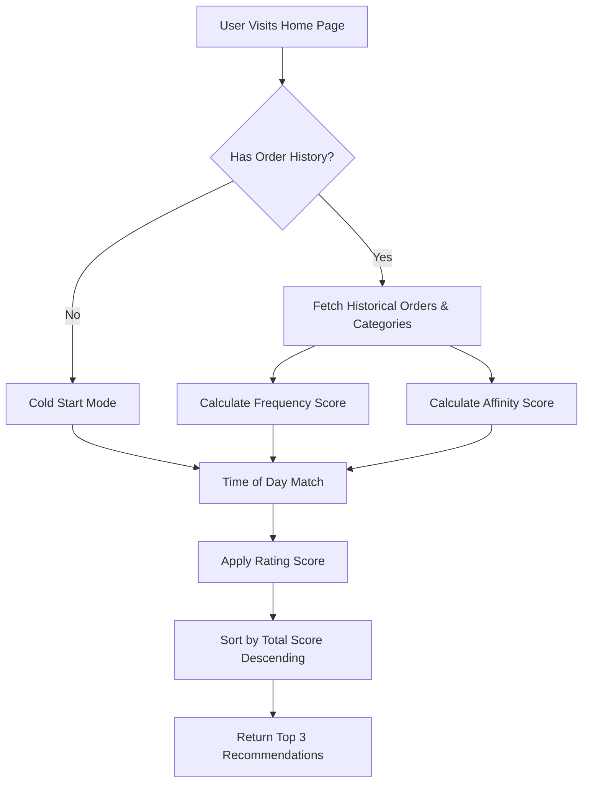

# AI Recommendation Engine: Logic & Architecture

This document outlines the design and scoring logic behind the Nosh AI Recommendation Engine. You can use this to walk your mentor through the algorithm.

## Overview

The recommendation engine provides personalized restaurant suggestions to users by calculating a **Relevance Score** (0.0 to 1.0) for each restaurant. The score is a weighted composite of four key metrics:

1. **Order Frequency (40%)**: How often the user orders from this restaurant.
2. **Time of Day (30%)**: How well the restaurant's cuisine matches the current time (Breakfast, Lunch, Dinner, etc.).
3. **Category Affinity (20%)**: How much the user's historical food preferences align with the restaurant's menu.
4. **Normalized Rating (10%)**: The overall quality of the restaurant based on user ratings.

> [!NOTE]
> If a user is new (Cold Start) and has no order history, the engine automatically falls back to general recommendations based heavily on **Time of Day** and **Rating**.

---

## Architecture Flow

---

## Scoring Breakdown

### 1. Order Frequency (Weight: 0.4)
Identifies the user's "go-to" restaurants.
- **Calculation**: `(User's orders at this restaurant) / (User's max orders at any single restaurant)`
- **Example**: If a user ordered from Pizza Hut 5 times (their maximum) and Burger King 2 times, Pizza Hut gets a score of `1.0`, and Burger King gets `0.4`.

### 2. Time of Day (Weight: 0.3)
Contextualizes the recommendation based on the user's current local time.
- **Calculation**: Binary match `(1 or 0)`. If the restaurant serves a category that fits the current time window, it receives a full score.
- **Time Windows**:
  - `05:00 - 11:00`: Breakfast, Pastries, Beverages
  - `11:00 - 16:00`: Lunch (Salads, Sandwiches, Mains)
  - `16:00 - 19:00`: Snack (Appetizers, Tapas, Desserts)
  - `19:00+`: Dinner (Curries, Pasta, Seafood, Mains)

### 3. Category Affinity (Weight: 0.2)
Matches a user's broader taste profile to new restaurants they haven't tried yet.
- **Calculation**: `(Total items ordered by user in matching categories) / (Total items ever ordered by user)`
- **Example**: If a user has ordered 10 items total, and 4 of them were 'Asian Specialties', an untried Asian restaurant will receive an affinity score of `0.4`.

### 4. Normalized Rating (Weight: 0.1)
Ensures baseline quality is respected.
- **Calculation**: `(Restaurant Rating) / 5.0`
- **Example**: A 4.5-star restaurant gets a score of `0.9`.

---

## Dynamic Reasoning Engine

Once the scores are calculated, the engine determines the primary reason for the recommendation to display a human-readable tag in the UI (e.g., in the Restaurant Card tooltip).

It isolates the metric that contributed the most absolute value to the final score:

- **Order Frequency Wins**: `"Your usual pick"`
- **Category Affinity Wins**: `"Matches your taste"`
- **Time of Day Wins**: `"Perfect for [Breakfast/Lunch/Dinner] right now"`
- **Fallback / Cold Start**: `"Highly rated"`

> [!TIP]
> **Future Improvements to discuss with your mentor:**
> - Integrating geolocation to factor in delivery times.
> - Adding a collaborative filtering model (e.g., "Users similar to you also liked...").
> - Adding a recency decay factor to order history so older preferences weigh less.
